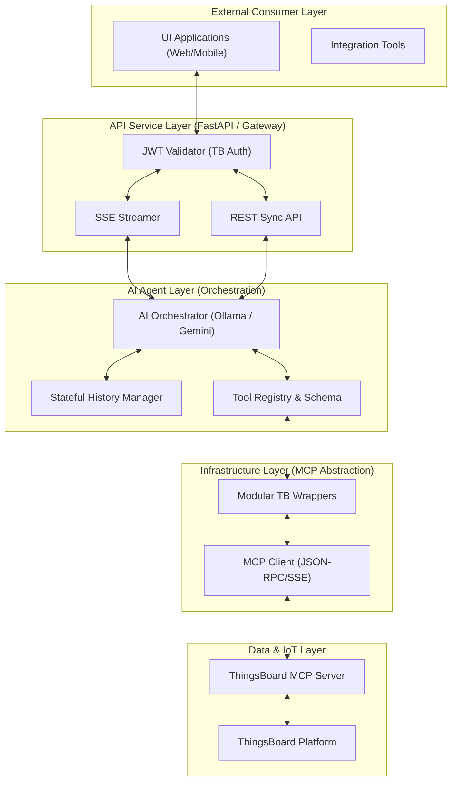
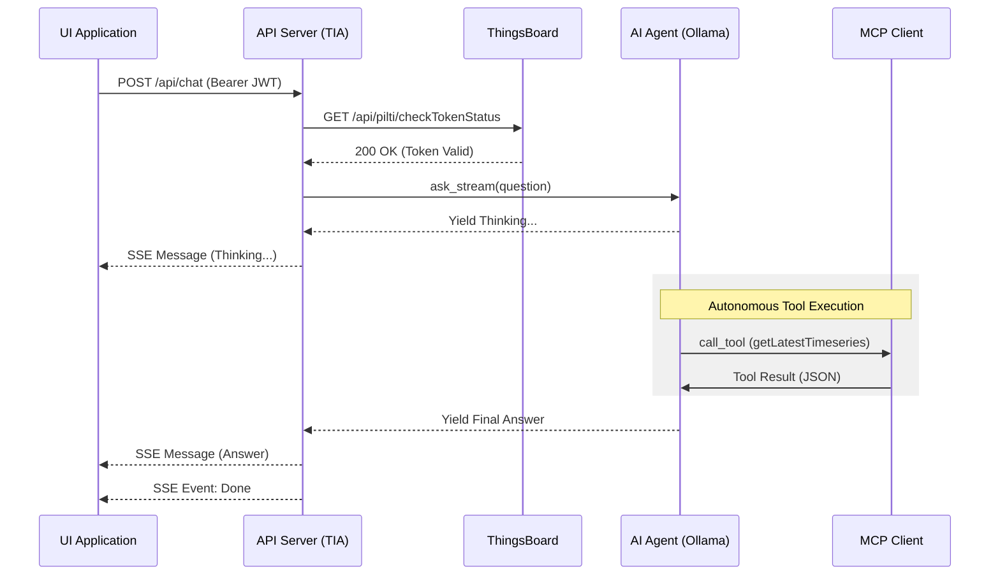

# ThingsBoard Intelligent Agent Service (TIA)

[](https://your-docs-link.com)
[](https://modelcontextprotocol.io)
[](https://fastapi.tiangolo.com)

## 📋 Executive Summary
ThingsBoard Intelligent Agent (TIA) is an enterprise-grade middleware service that bridges Large Language Models (LLMs) with the ThingsBoard IoT ecosystem. Leveraging the **Model Context Protocol (MCP)**, TIA enables natural language interaction with complex IoT datasets, automated telemetry analysis, and proactive device management through a secure, scalable API layer.

---

## 🏗 Enterprise Architecture

### 1. High-Level System Architecture
The following diagram illustrates the layered approach, highlighting the separation of concerns between the API Gateway, Agent Orchestration, and Downstream Connectivity.



### 2. Sequence Flow: Streaming Chat Interaction
This sequence diagram shows the end-to-end flow of a streaming request with ThingsBoard JWT authentication.



---

## 🛡 Security & Authentication
TIA implements a **Zero-Trust Delegation** model. It does not store user credentials. Instead, it delegates authentication to the primary ThingsBoard instance.

- **Authentication Method**: JWT (JSON Web Token) via Bearer Header.
- **Validation**: Every request is validated against the internal `/api/pilti/checkTokenStatus` endpoint.
- **Access Control**: The agent's capabilities are restricted by the permissions associated with the provided JWT token.

---

## 🚀 API Specification

### 1. Streaming Interaction (SSE)
Designed for responsive UIs where the AI's "thought process" and response are shown incrementally.
- **URL**: `/api/chat`
- **Method**: `POST`
- **Auth**: `Authorization: Bearer <JWT>`
- **Body**: `{"question": "What is the average humidity today?"}`

### 2. Standard Synchronous Interaction
Designed for integration with automated systems or simple REST consumers.
- **URL**: `/api/chat/sync`
- **Method**: `POST`
- **Auth**: `Authorization: Bearer <JWT>`
- **Response**: `{"content": "Full response text here..."}`

---

## 🛠 Feature Modules

| Module | Description | Technical Focus |
| :--- | :--- | :--- |
| **`tb_telemetry`** | Timeseries & Analytics | Accurate 24h windows, client-side aggregation. |
| **`tb_device`** | Device Inventory | Bulk search, info retrieval, connection status. |
| **`tb_attributes`** | Entity Metadata | Shared vs Server attributes management. |
| **`tb_assets`** | Hierarchy Management | Asset relation and grouping navigation. |
| **`auth_service`** | Security Layer | ThingsBoard identity delegation. |

---

## ⚙️ Enterprise Configuration
System configuration is centralized in `config.py`.

```python
# Deployment targets
THINGSBOARD_URL = "http://tb.example.com"
MCP_SERVER_URL  = "http://192.168.1.165:8090"

# AI Inference Engine
AGENT_TYPE = "ollama"  # Production: 'ollama' for local privacy, 'gemini' for scale
OLLAMA_BASE_URL = "http://192.168.1.40:11434"
OLLAMA_MODEL = "qwen2.5:7b"
```

---

## 📦 Deployment Guide

### Industrial Deployment (Docker/Linux)
1. **Clone & Environment**:
   ```bash
   git clone <repo-url>
   cd agent
   ```
2. **Runtime Setup**:
   ```bash
   python -m venv venv
   source venv/bin/activate
   pip install -r requirements.txt
   ```
3. **Run Production Server**:
   ```bash
   uvicorn api_server:app --host 0.0.0.0 --port 8000 --workers 4
   ```

---

*TIA is maintained by the Advanced AI Solutions Team. For enterprise support, contact your system administrator.*
