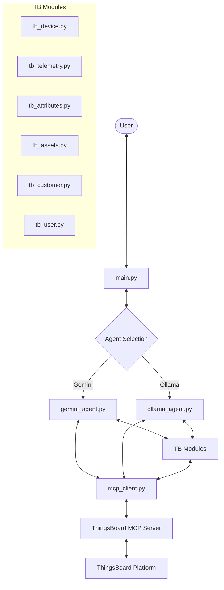

# Gemini & Ollama ThingsBoard Agent

A multi-backend AI agent that interacts with ThingsBoard IoT platform via the Model Context Protocol (MCP). Supports both **Google Gemini** and **Ollama** (local LLMs).

## 🏗 Architecture



### Core Components

- **`main.py`**: The entry point providing a simple CLI for user interaction.
- **`gemini_agent.py`**: The "brain" of the system. It initializes the Gemini model, registers ThingsBoard tools, and manages conversation history.
- **`mcp_client.py`**: A low-level client for communicating with the ThingsBoard MCP server using SSE (Server-Sent Events) and JSON-RPC.
- **`tb_*.py`**: Feature-specific modules (devices, telemetry, etc.) that wrap MCP tool calls into Python functions for the agent.

## 🚀 Getting Started

### Prerequisites

- Python 3.10+
- A Gemini API Key
- A running ThingsBoard MCP Server

### Setup

1. **Clone the repository**:
   ```bash
   git clone <repository-url>
   cd agent
   ```

2. **Install dependencies**:
   ```bash
   pip install -r requirements.txt
   ```
   *(Note: Ensure `requests`, `sseclient-py`, and `google-genai` are installed)*

3. **Configure Environment**:
   Update `config.py` with your settings:
   ```python
   # Agent Selection
   AGENT_TYPE = "gemini" # or "ollama"

   # Gemini Config
   GEMINI_API_KEY = "your_gemini_api_key"

   # Ollama Config
   OLLAMA_BASE_URL = "http://192.168.1.40:11434"
   OLLAMA_MODEL = "llama3.1"

   # MCP Server
   MCP_SERVER_URL = "http://192.168.1.165:8090"
   ```

### Usage

Run the main script to start the interactive chat:

```bash
python main.py
```

Example queries:
- "List all devices in my tenant."
- "What is the latest temperature for Device A?"
- "Get details for the asset 'Warehouse 1'."
- "List all users assigned to Customer X."

## 🛠 Features

- **Device Management**: List, get by ID/name, and search devices.
- **Telemetry & Attributes**: Query real-time and historical timeseries data and entity attributes.
- **Asset & Customer Management**: Access assets and customer information.
- **User Management**: Manage tenant and customer users.
- **Natural Language Interaction**: Complex queries are handled by Gemini 1.5 Flash.

---
*Built with ❤️ using Google Gemini and ThingsBoard MCP.*
