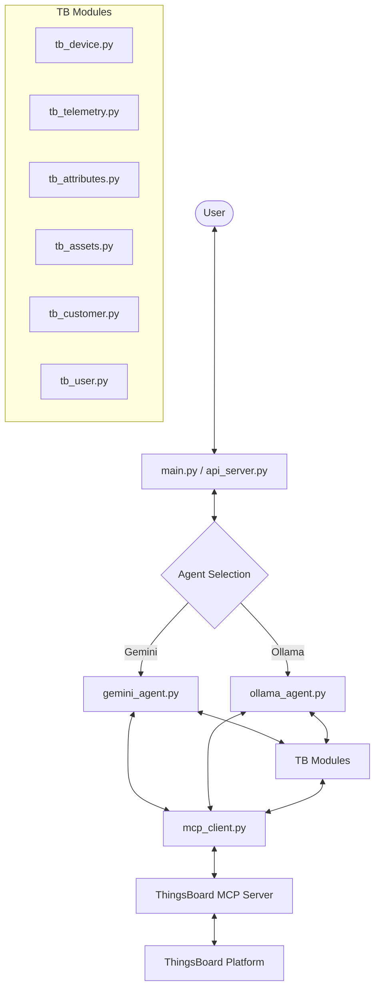
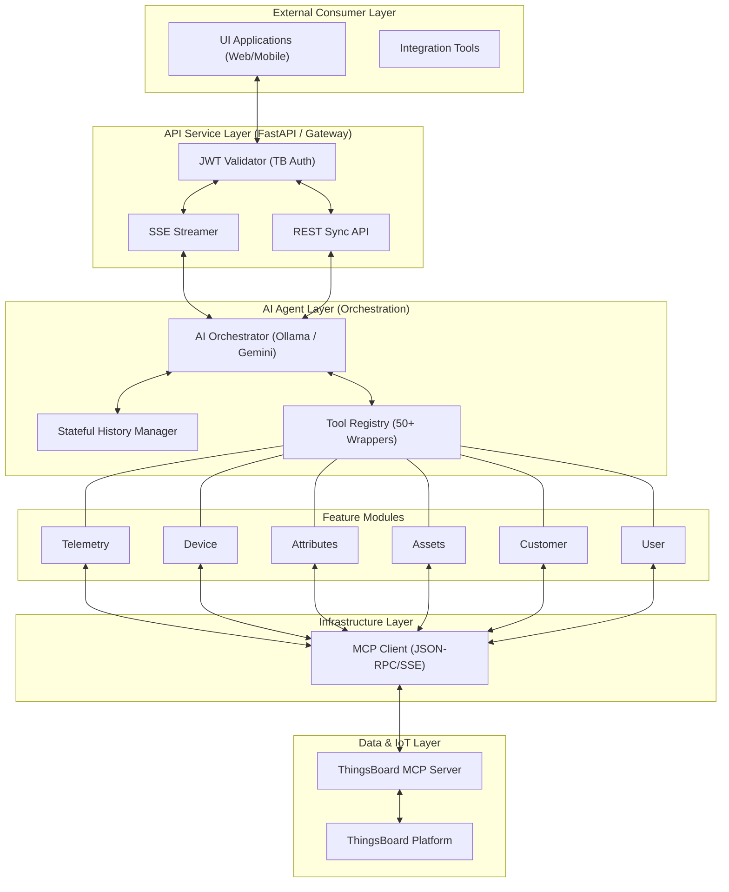
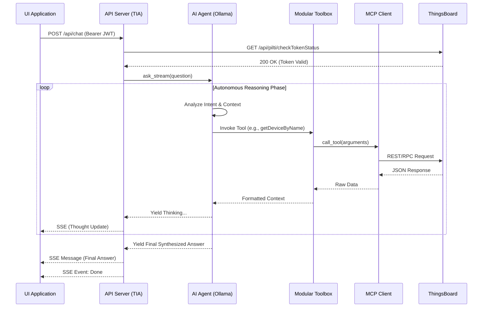
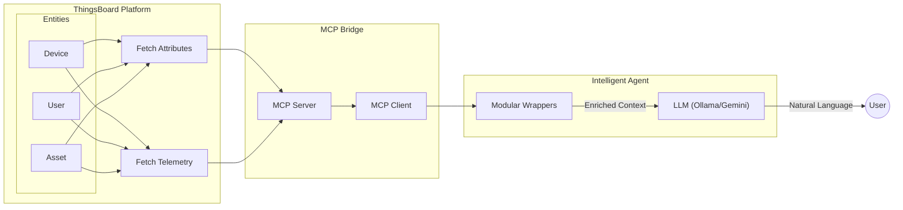

# 🤖 Gemini & Ollama ThingsBoard Agent

A multi-backend AI agent that interacts with ThingsBoard IoT platform via the Model Context Protocol (MCP). Supports both **Google Gemini** and **Ollama** (local LLMs).

[](https://your-docs-link.com)
[](https://modelcontextprotocol.io)
[](https://fastapi.tiangolo.com)

## 📋 Executive Summary
ThingsBoard Intelligent Agent (TIA) is an enterprise-grade middleware service that bridges Large Language Models (LLMs) with the ThingsBoard IoT ecosystem. Leveraging the **Model Context Protocol (MCP)**, TIA enables natural language interaction with complex IoT datasets, automated telemetry analysis, and proactive device management through a secure, scalable API layer.

## 🏗 Architecture

The following diagram shows the internal orchestration flow between the user interface, the agent selection logic, and the ThingsBoard platform through the MCP bridge.



### Core Components

- **`main.py / api_server.py`**: The entry points providing a simple CLI or a robust FastAPI server for user interaction.
- **`gemini_agent.py / ollama_agent.py`**: The "brains" of the system. They initialize the respective models, register ThingsBoard tools, and manage conversation history.
- **`mcp_client.py`**: A low-level client for communicating with the ThingsBoard MCP server using SSE (Server-Sent Events) and JSON-RPC.
- **`tb_*.py`**: Feature-specific modules (devices, telemetry, etc.) that wrap MCP tool calls into Python functions for the agent.

---

## 🏗 Enterprise Integration

### 1. Detailed System Flow
The following diagram highlights the separation of concerns between the API Gateway, Agent Orchestration, and Downstream Connectivity.



### 2. Sequence Flow: Autonomous Tool Execution Loop
TIA employs an autonomous loop where the agent iteratively calls tools until a comprehensive answer is reached.



### 3. Data Flow: From IoT to Intelligence
This diagram shows how data from various entities is transformed from raw platform metrics into natural language insights.



---

## 🛡 Security & Authentication
TIA implements a **Zero-Trust Delegation** model. It does not store user credentials. Instead, it delegates authentication to the primary ThingsBoard instance.

- **Authentication Method**: JWT (JSON Web Token) via Bearer Header.
- **Validation**: Every request is validated against the internal `/api/pilti/checkTokenStatus` endpoint.
- **Access Control**: The agent's capabilities are restricted by the permissions associated with the provided JWT token.

---

## 🚀 API Specification

### 1. Streaming Interaction (SSE)
Designed for responsive UIs where the AI's "thought process" and response are shown incrementally.
- **URL**: `/api/chat`
- **Method**: `POST`
- **Auth**: `Authorization: Bearer <JWT>`
- **Request Body**: 
  ```json
  {
    "question": "What is the status of Device A?"
  }
  ```
- **Response**: `text/event-stream` (SSE)
  ```text
  data: {"content": "Thinking..."}
  data: {"content": "..."}
  data: [DONE]
  ```

### 2. Standard Synchronous Interaction
Designed for integration with automated systems or simple REST consumers.
- **URL**: `/api/chat/sync`
- **Method**: `POST`
- **Auth**: `Authorization: Bearer <JWT>`
- **Response**: `application/json`

### 3. Health Check
Used to verify the service status and active AI agent type.
- **URL**: `/api/health`
- **Method**: `GET`
- **Response**: `{"status": "ok", "agent": "ollama"}`

---

## 🛠 Feature Modules

| Module | Description | Technical Focus |
| :--- | :--- | :--- |
| **`tb_telemetry`** | Timeseries & Analytics | Accurate 24h windows, client-side aggregation. |
| **`tb_device`** | Device Inventory | Bulk search, info retrieval, connection status. |
| **`tb_attributes`** | Entity Metadata | Shared vs Server attributes management. |
| **`tb_assets`** | Hierarchy Management | Asset relation and grouping navigation. |
| **`tb_user`** | User Management | User profile, role verification, and details. |
| **`auth_service`** | Security Layer | ThingsBoard identity delegation. |

---

## 🔄 IoT Device Lifecycles (Supported Hardware)
TIA provides specialized handling and LLM-ready context for a diverse range of IoT hardware.

### 1. Vital Health Monitoring (ECG & Bio-Probes)
- **ECG Monitor**: Real-time heartbeat amplitude streaming and historical waveform analysis.
- **Heartbeat Probe**: Comprehensive vital tracking (BPM, BP, SpO2) with integrated predictive analytics for 24-72h trends.

### 2. Industrial Environmental Probes
- **Universal Probe**: High-precision tracking of Temperature, Humidity, AQI, and Air Quality (CO, NH3, NO2, O3, PM2.5).
- **WL (Water Level)**: Real-time distance measurement with automated tank volume calculations (Liters/Gallons).
- **Tag Probe**: Ultra-compact temperature sensing for mobile or space-constrained assets.

### 3. Server Infrastructure Monitoring
- **Pilti Server**: Performance tracking for backend nodes, covering CPU load, memory pressure, and Disk I/O.
- **Advanced Inspection**: Integration with the Beszel/Grafana dashboards for system-level analytics.

### 4. Security & Access Control
- **RFID Scanner**: Perimeter security with remote RPC trigger support (`OpenLock`) and access audit logs.
- **Access Cards**: Detailed credential management and historical audit trails for individual cardholders.

### 5. Network & Offline Management
- **Local Config**: Bootstrap provisioning via SoftAP and local HTTP handshake (Port 233) for secure SSID/MacID exchange.

---

## ⚙️ Enterprise Configuration
System configuration is centralized in `config.py`.

```python
# Deployment targets
THINGSBOARD_URL = "https://tb-test.example.com"
MCP_SERVER_URL  = "http://192.168.1.165:8090"

# AI Inference Engine
AGENT_TYPE = "ollama"  # 'ollama' or 'gemini'

# Ollama Config
OLLAMA_BASE_URL = "http://192.168.1.40:11434"
OLLAMA_MODEL = "qwen3:8b"

# Gemini Config
GEMINI_API_KEY = "AIzaSy..."
```

---

## 🚀 Getting Started

### Prerequisites

- Python 3.10+
- A Gemini API Key (if using Gemini)
- [Ollama](https://ollama.com/) installed (if using local LLMs)
- A running ThingsBoard MCP Server (hosted in Proxmox or locally)

### Setup

1. **Clone the repository**:
   ```bash
   git clone <repository-url>
   cd agent
   ```

2. **Install dependencies**:
   ```bash
   pip install -r requirements.txt
   ```
   *(Note: Ensure `requests`, `sseclient-py`, and `google-genai` are installed)*

3. **Configure Environment**:
   Update `config.py` with your settings:
   ```python
   # Agent Selection
   AGENT_TYPE = "ollama" # or "gemini"

   # Gemini Config
   GEMINI_API_KEY = "your_gemini_api_key"

   # Ollama Config
   OLLAMA_BASE_URL = "http://192.168.1.40:11434"
   OLLAMA_MODEL = "qwen3:8b" # or llama3.1

   # MCP Server
   MCP_SERVER_URL = "http://192.168.1.165:8090"
   ```

### Usage

Run the main script to start the interactive CLI:
```bash
python main.py
```

Or start the Enterprise API Server:
```bash
python api_server.py
```

Example queries:
- "List all devices in my tenant."
- "What is the latest temperature for Device A?"
- "Get details for the asset 'Warehouse 1'."
- "List all users assigned to Customer X."

---

*TIA is maintained by the Advanced AI Solutions Team. For enterprise support, contact your system administrator.*
