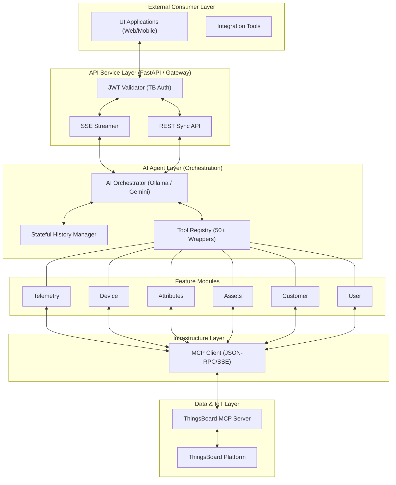

# 🤖 Gemini & Ollama ThingsBoard Agent

A multi-backend AI agent that interacts with ThingsBoard IoT platform via the Model Context Protocol (MCP). Supports both **Google Gemini** and **Ollama** (local LLMs).

[](https://your-docs-link.com)
[](https://modelcontextprotocol.io)
[](https://fastapi.tiangolo.com)

## 🏗 Architecture

The following diagram shows the internal orchestration flow between the user interface, the agent selection logic, and the ThingsBoard platform through the MCP bridge.


### Core Components

- **`main.py / api_server.py`**: The entry points providing a simple CLI or a robust FastAPI server for user interaction.
- **`gemini_agent.py / ollama_agent.py`**: The "brains" of the system. They initialize the respective models, register ThingsBoard tools, and manage conversation history.
- **`mcp_client.py`**: A low-level client for communicating with the ThingsBoard MCP server using SSE (Server-Sent Events) and JSON-RPC.
- **`tb_*.py`**: Feature-specific modules (devices, telemetry, etc.) that wrap MCP tool calls into Python functions for the agent.

---

## 🚀 Getting Started

### Prerequisites

- Python 3.10+
- A Gemini API Key (if using Gemini)
- [Ollama](https://ollama.com/) installed (if using local LLMs)
- A running ThingsBoard MCP Server (hosted in Proxmox or locally)

### Setup

1. **Clone the repository**:
   ```bash
   git clone <repository-url>
   cd agent
   ```

2. **Install dependencies**:
   ```bash
   pip install -r requirements.txt
   ```
   *(Note: Ensure `requests`, `sseclient-py`, and `google-genai` are installed)*

3. **Configure Environment**:
   Update `config.py` with your settings:
   ```python
   # Agent Selection
   AGENT_TYPE = "ollama" # or "gemini"

   # Gemini Config
   GEMINI_API_KEY = "your_gemini_api_key"

   # Ollama Config
   OLLAMA_BASE_URL = "http://192.168.1.40:11434"
   OLLAMA_MODEL = "qwen3:8b" # or llama3.1

   # MCP Server
   MCP_SERVER_URL = "http://192.168.1.165:8090"
   ```

### Usage

Run the main script to start the interactive CLI:
```bash
python main.py
```

Or start the Enterprise API Server:
```bash
python api_server.py
```

Example queries:
- "List all devices in my tenant."
- "What is the latest temperature for Device A?"
- "Get details for the asset 'Warehouse 1'."
- "List all users assigned to Customer X."

---

## 🏗 Enterprise Integration

### 1. Detailed System Flow
The following diagram highlights the separation of concerns between the API Gateway, Agent Orchestration, and Downstream Connectivity.



---

## 🚀 API Specification

### 1. Streaming Interaction (SSE)
- **URL**: `/api/chat` | **Method**: `POST` | **Auth**: `Bearer <JWT>`
- **Request**: `{"question": "What is the status of Device A?"}`
- **Response**: `text/event-stream` with thought/answer chunks.

### 2. Synchronous Interaction
- **URL**: `/api/chat/sync` | **Method**: `POST` | **Auth**: `Bearer <JWT>`
- **Response**: `application/json` with the complete answer.

### 3. Health Check
- **URL**: `/api/health` | **Method**: `GET`
- **Response**: `{"status": "ok", "agent": "ollama"}`

---

## 🛠 Feature Modules

| Module | Description |
| :--- | :--- |
| **`tb_telemetry`** | Historical & Real-time timeseries analysis. |
| **`tb_device`** | Device inventory, connection status, and search. |
| **`tb_attributes`** | Shared/Server metadata management. |
| **`tb_assets`** | Hierarchy and asset relation navigation. |
| **`tb_user`** | User profiles, roles, and details. |

---

## 🔄 IoT Device Lifecycles (Supported Hardware)
- **Vital Monitoring**: ECG Waveforms, Heartbeat SpO2, Predictive BP trends.
- **Environmental**: Temp/Humidity, AQI, Air Quality (CO, NH3, NO2, O3, PM2.5).
- **Industrial WL**: Water Level distance and Volume calculations.
- **Infrastructure**: Pilti Server (CPU/Mem/IO), Beszel/Grafana monitoring.
- **Security**: RFID Perimeter access, Asset Tag tracking, Access Audit logs.

---
*Built with ❤️ using Google Gemini and ThingsBoard MCP.*
